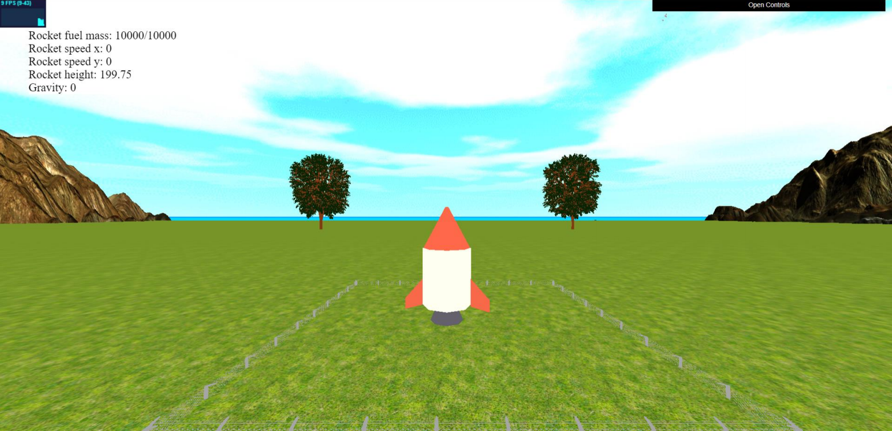
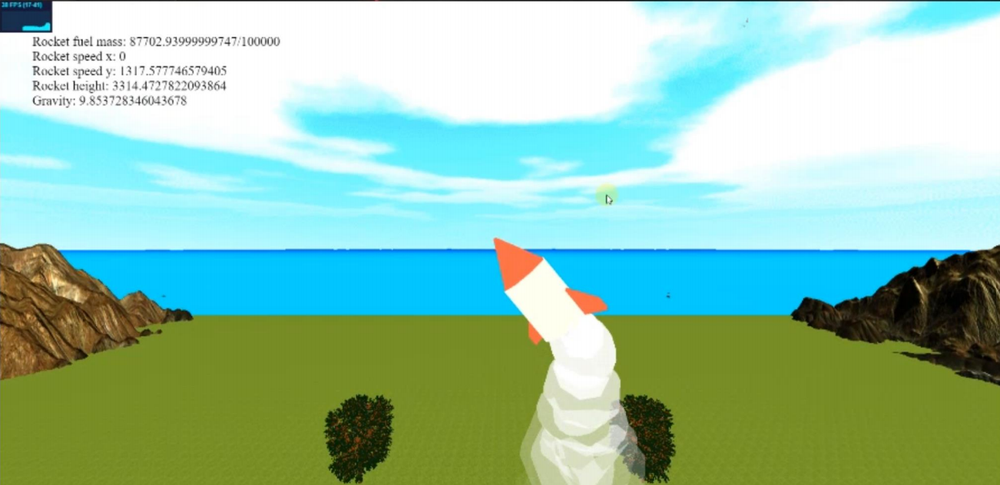
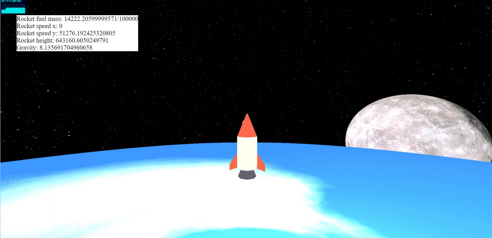

# Rocket Simulator Project
This is a project to simulate the flight of a rocket in a 3D environment using 'three.js' library. The rocket is defined by several properties such as its position, mass, fuel mass, height, radius, head type, engine type, temperature, and nozzle radius. The simulation also takes into account the gravity force, exhaust velocity, atmospheric pressure, and other factors that affect the rocket's flight.

## ScreenShots






## Project Structure
The main simulation code is located in the 'Rocket.js' file. This file defines the Rocket class with its properties and methods. The 'vector.js' file contains a simple implementation of a 2D vector. The 'world.js' file defines some constants used in the simulation such as the earth's radius, mass, and gravitational constant. The index.html file includes the necessary dependencies, sets up the 3D environment, and starts the simulation.

## Installation
1. Clone this repository: ```git clone https://github.com/aqeel-saeed/rocket-simulation```
2. Download 'static.rar' file from [here](https://t.me/Aqeel_Raiee/2295).
3. Extract the contents of 'static.rar' in the root of the project.
4. Install the required dependencies: ```npm install```
5. Run this command to run the server: ```npm run dev```

## How to Use
After running the simulation, you can see the rocket in the 3D environment. You can use the arrow keys to move the camera around. You can also modify the properties of the rocket in the Rocket class constructor to see how they affect the flight. For example, you can change the engine type, head type, or temperature. Then you have to press 'space' and the rocket will start to move. use 'a' and 'd' to change the angle of the rocket. 

## Future Improvements
This project is a simple simulation that can be extended and improved in several ways. For example, you can add more realistic 3D models for the rocket and the environment, add more properties and methods to the Rocket class, or implement more advanced physics models. You can also add user input to control the rocket's flight or add a graphical user interface to change the rocket's properties.

## Team Members
This project was created by:
- Aqeel Raiee
- Nezar Abo-Haileh
- Ward Al-Shaheen
- Huthaifa Zieadeh